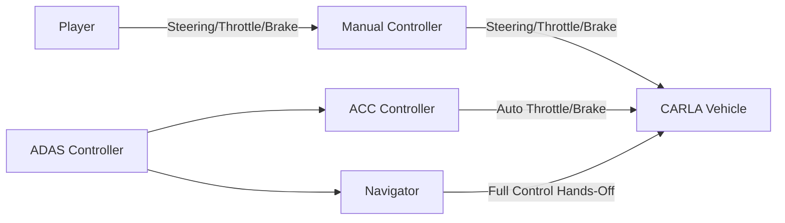
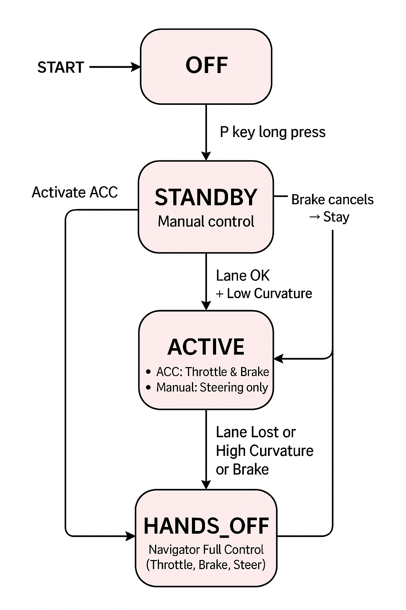

# 🚗 Driving Simulation Study Documentation

## Outline

1. [Pre-Simulation Briefing](#1️⃣-pre-simulation-briefing)
2. [Case Study 1: Combined Features](#2️⃣-case-study-1-combined-features)
3. [Case Study 2: Individual Features](#3️⃣-case-study-2-individual-features)
4. [Background Story for Participants](#4️⃣-background-story-for-participants)
5. [Simulation Design Scenario Sequencing](#5️⃣-simulation-design-scenario-sequencing)
6. [Integration with Existing Code](#6️⃣-integration-with-existing-code)

## 📌 Overview

This document outlines the conceptual and technical design of the **ProPILOT Driving Simulation Study**. It presents the scenario sequencing, system architecture, and integration plan for simulating real-world driving conditions where Advanced Driver Assistance Systems (ADAS) are employed in varying environments. The core objective of this study is to **augment existing hardware-based ProPILOT investigations** by providing a controlled, immersive simulation platform that enables **richer behavioral and usability analyses**.

### Study Goals

The simulation is designed to explore how drivers:

- Form and adapt **mental models** of ADAS features over time.
- Respond to overlapping and evolving automation functionalities.
- Navigate scenarios that test system trust, handoff behavior, and edge-case comprehension.

By simulating complex scenarios—such as degraded lane environments, transition zones, and highways with high ADAS availability—we aim to move **beyond traditional Cognitive Task Analysis (CTA)** methods. This system:

- Integrates real-time driver input (steering, braking, throttle).
- Records contextual state data (ADAS mode, warnings, environment).
- Captures qualitative and quantitative behavior data for analysis.

Ultimately, this simulation acts as both a **diagnostic tool** for identifying usability issues and a **design probe** to inform the development of **user-centered, adaptive ADAS systems**.

---

## 1️⃣ Pre-Simulation Briefing

### 🎯 Purpose

The briefing is designed to:

- Provide a **shared narrative context** for all participants.
- Align expectations about the driving task and system behavior.
- Enhance **immersion** and cognitive framing before entering the simulator.

### 🗣️ Narrative

Participants will be introduced to the driving task through the following scenario:

> _"You are driving from your home in a moderately quiet residential neighborhood to your workplace located along a moderately busy highway. Your commute takes you through three distinct environments:_
>
> - _A degraded residential area, where road markings are faint and traffic signs may be partially obscured._
> - _A transition road representing connector infrastructure with moderate traffic flow and varied navigation challenges._
> - _A baseline highway, where lane markings are clear and the ADAS system is expected to function at full capacity._
>
> Throughout the drive, you will receive voice-based GPS guidance and can engage the ProPILOT Assist system. You are expected to obey traffic rules and drive as naturally as possible, responding to environmental and system changes as they arise."\_

### 🛠️ Implementation Details

- **Visual Display**: Full-screen black background with multi-line briefing text rendered in white using `pygame.font`.
- **Audio Narration**: (Optional) Use `pyttsx3` or `pygame.mixer` for text-to-speech playback of the narrative.
- **User Interaction**: A visible “Start Simulation” button or key-press prompt (e.g., `Press [Enter] to begin`) enables users to advance when ready.

### 🔧 Technical Integration

- Introduce a new simulation state: `STATE_BRIEFING` in the `Game` class.
- When the simulation starts, enter `STATE_BRIEFING` and block scenario logic.
- On user confirmation (keypress or button click), transition into `Scenario 1: Degraded Residential`.
- Briefing screen should:
  - Reset and initialize all game variables (e.g., vehicle spawn, ADAS state).
  - Optionally allow a short “tutorial mode” for first-time participants.

## <!-- The study focus on 2 main ADAS Feature provided in the Nissan ProPLIOT Asssist 2025 model v2, one feature from longitudinal classification ADAS feature,ACC( Adaptive Cruise Control), and the other from the lateral Adas feature (LKS (lane keep assist)). On the Nissan ProPLIOT Asssist 2025 model v2, the feature are combined meaning they have on activation logic button for the user to enage the feature. However, we want to investigate the combined featue and individual feature to undaerstan the suitablity to users mental and cognative model. See the state diagram to understand the activatiation logic for both cases better. -->

## 2️⃣ Case Study 1: Combined ADAS Features

### 🎯 Objective

This phase of the study investigates the driver's interaction with **combined Advanced Driver Assistance System (ADAS) features**, as implemented in the 2025 Nissan ProPILOT Assist v2. In this system, **Adaptive Cruise Control (ACC)**—a longitudinal control feature—and **Lane Keep Assist (LKA)**—a lateral control feature—are jointly activated using a single interface button. The study seeks to evaluate:

- How well drivers mentally model and adapt to a **combined ADAS interface**.
- Whether a shared activation logic enhances or hinders user trust, control clarity, and system comprehension.
- Situational effectiveness and usability across distinct road conditions.

A **state diagram** is referenced (to be included in the appendix or system overview) to illustrate the logic and transitions involved in activating and using the combined ProPILOT system.

### 🔬 Experimental Flow: Combined Features Enabled

---

### 🚗 Scenario 1: Degraded Residential Environment

- **Environment Characteristics:**

  - Faded or broken lane markings.
  - Partially obstructed or missing signage.
  - Parked vehicles, light pedestrian activity.
  - Narrow road widths typical of residential neighborhoods.

- **Research Focus:**

  - Can drivers maintain confidence and control when visual inputs (e.g., lanes, signage) are degraded?
  - How does the combined ADAS respond when only partial sensor information is available?

- **Technical Implementation:**
  - Use CARLA **Town04** for suburban street layout.
  - Dynamically reduce lane marking contrast.
  - Use `CarlaTrafficSpawner` to inject parked cars and scripted pedestrians at crosswalks or driveways.

---

### 🛣️ Scenario 2: Transition Road (Connector)

- **Environment Characteristics:**

  - Improved lane markings and signage clarity.
  - Medium traffic density.
  - Progressive speed limit increase from residential to highway levels.
  - Simulated navigation transitions (e.g., on-ramp merge).

- **Research Focus:**

  - Evaluate how ADAS systems handle transitions—especially acceleration and lane changes.
  - Observe user behavior in response to external agents (e.g., cut-in vehicles, stop-and-go traffic).

- **Technical Implementation:**
  - Continue using **Town04**, but move to connector segments and arterial roads.
  - Introduce `Cut-in Vehicle` and `Stop-and-Go` sub-scenarios using behavior trees.
  - GPS navigation audio/visual prompts triggered through waypoint tracking and TTS (Text-to-Speech) systems.

---

### 🛤️ Scenario 3: Baseline Highway

- **Environment Characteristics:**

  - Wide lanes with high visibility.
  - Clear signage and consistently marked lanes.
  - Free-flowing, medium to high-speed traffic (~100 km/h / 65 mph).

- **Research Focus:**

  - Assess ACC + LKA performance in ideal, fully-supported ADAS conditions.
  - Establish baseline for comparison with earlier scenarios.

- **Technical Implementation:**
  - Use Town04 highway segments (or Town05 for variation).
  - High-speed telemetry logged: throttle, brake, ADAS mode changes, lateral offset.

---

### 🧾 Behavioral & System Logging Timeline

To evaluate the effectiveness and clarity of ADAS interaction, a **structured logging strategy** is used to align participant behavior, system state, and environmental context on a unified timeline:

#### ⏱️ Event-Based Data Capture

| Time (Relative)                         | Data Captured                                                                                                                                                                                                                          | Description                                                                                    |
| --------------------------------------- | -------------------------------------------------------------------------------------------------------------------------------------------------------------------------------------------------------------------------------------- | ---------------------------------------------------------------------------------------------- |
| -5s to 0s _(before ADAS activation)_    | 🧍 Participant Hand Position   😊 Facial Expression   🎙️ Audio (Think-Aloud)   🚗 Vehicle State (speed, lane pos)   🎥 Driver View (Front Camera)                                                                          | Establish baseline behavior before engagement. Assess attention level, hesitation, or routine. |
| 0s _(ProPILOT Activation)_              | 🔄 System State Transition   ✅ Button press logged   🧠 Cognitive load cue via voice                                                                                                                                            | Synchronize all streams to the moment of activation.                                           |
| 0s–Disengage                            | 📡 Continuous Logging:   - Hands on/off wheel   - Eye gaze (if available)   - Verbal utterances   - ADAS mode changes   - Vehicle telemetry (speed, brake, throttle, heading)   - Road context snapshot (frame tags) | Track driver-system interaction quality and adaptation over time.                              |
| Disengage (Manual Override or Auto-Off) | ⛔ Log disengagement reason (manual, system error, etc.)   🔚 Event Marker                                                                                                                                                          | Used for later correlation with stress cues or decision-making mismatches.                     |

---

### 🧠 Post-Scenario Reflection

Participants will be prompted to verbally reflect on:

- Whether the system performed as expected.
- Their confidence in the system's decisions.
- Points of confusion or uncertainty.
  This audio is timestamped and synced to the driving log.

---

### 🛑 End Screen

- Upon completion of all three scenarios:
  - Display a **“Thank You”** message and instructions.
  - Save participant data automatically, including telemetry, ADAS state transitions, and scenario events.
  - Option to **restart the study** or **exit to main menu**.

---

## 3️⃣ Case Study 2: Individual ADAS Features

### 🎯 Objective

In this phase, the same scenarios are repeated, but the ADAS features—**Adaptive Cruise Control (ACC)** and **Lane Keep Assist (LKA)**—are activated **independently** rather than through a unified interface. The aim is to assess:

- Whether independent feature control aligns better with users’ cognitive models.
- If drivers show more targeted trust and expectation behavior (e.g., assuming LKA is off while ACC is on).
- How segmented feedback impacts usability and comprehension.

### 🧪 Experimental Differences

- Participants control each feature **individually**, mimicking earlier-generation or alternative interface designs.
- ADAS activation buttons are separated in the UI and activation logic.

### 🔄 Scenario Reuse

- The same three scenarios are reused:
  - Degraded Residential
  - Transition Road
  - Baseline Highway

This design enables **direct comparison** between combined and individual feature configurations under **identical road and traffic conditions**.

### ⚙️ Technical Notes

- ScenarioManager will:
  - Load the same scenario environments but use a modified ADAS controller module.
  - Switch between combined and isolated activation modes based on study phase.
- Data is **saved separately** for each feature configuration for post-simulation comparison.

---

<!--
## 4️⃣6️⃣ Background Story
### Text:

> “You are driving from your home in a quiet residential neighborhood to your workplace located along a moderately busy highway. The route takes you through three distinct environments:
> 1️⃣ A degraded residential area with faint lane markings and partially obscured signs.
> 2️⃣ A transition road with light traffic and navigation prompts to merge onto a highway.
> 3️⃣ A baseline highway with clear lane markings and consistent traffic flow.
>
> During the simulation, you will receive GPS voice guidance. Follow the directions naturally, obey traffic laws, and engage the ProPilot assistance as instructed.”

### Purpose:

- Set narrative context.
- Explain environmental challenges and ADAS involvement.

### Technical:

- Implement as part of the **Pre-Sim Briefing** screen.
- Optionally add TTS narration for immersion.

--- -->

## 4️⃣ Simulation Design (Scenario Sequencing)

### Design Elements

✅ **Maps:** CARLA Town04 (residential + highway).  
✅ **ScenarioManager:** Handles scenario switching and event triggers.  
✅ **Voice Navigation:** Use TTS (`pyttsx3`) or pre-recorded `.wav` files with `pygame.mixer`.  
✅ **Vehicle Sound Manager:** Engine start, idle, RPM, and collision sounds.  
✅ **Logging:** Save speed, lane position, ADAS state transitions, and hands-off timestamps.

---

## 5️⃣ Integration With Existing Code

### Game Class

- Manages the simulation loop.
- Calls `ScenarioManager` for scenario progression.
- Handles ADAS + ACC logic.

### ScenarioManager

- Loads maps and spawns entities.
- Triggers navigation and environmental events.
- Manages data logging per scenario.

### Navigation Module

- Generates route waypoints.
- Plays TTS navigation prompts.
- Displays next turn on HUD.

### Intro Screen

- Displays background story before starting Scenario 1.
- Waits for user confirmation.

---

## ✅ Next Steps

- [ ] Case study 1
  - [] Test brief Screen
  - [] Build GPS Nav Interface
- [ ] Build `NavigationModule` with TTS and HUD integration.
- [ ] Add pre-sim briefing screen with background story.
- [ ] Integrate with ACC/ADAS logic for control takeover.
- [ ] Add full telemetry and ADAS state logging.

## ✅ Issues

- [ ] Migrating to WINDOWS
  - [x] Screen settings modification
  - [x] Joystick ForceFeedBack requires hib Settings
  - []

## Appendix

Controller System Diagram

Flowchart for system

ADAS State Flowchart

