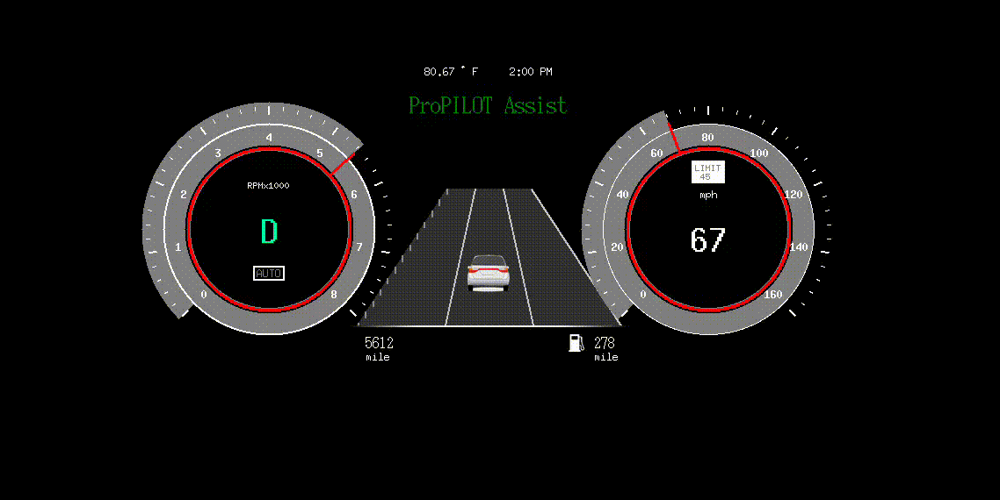

# Project Update

Due Date: 07/07/2025
Done: No

# 🗓️ Weekly Update — [ADAS Project - ProPilot] - June 30, 2025

## ✅ This Week’s Progress

- [x]  Joystick Mapping([see details](https://github.com/adiautomotive/CARLA-Propilot/tree/devel_dara?tab=readme-ov-file#controls) )
- [x]  Display Image modification (BGRA → RGB)
- [x]  Tested my WaypointNAV code with the ProPiLOT LKA
    - [x]  Tested ACC accuracy
    - [x]  Tested LKA as WaypointNAV →
        - [x]  Speak to Adithya about “lane-check” function
            - [x]  Update the lane-check based on Adithya reason
        - [x]  Design a scenario with degraded lane for LKA POC
- [x]  Designed the preliminary version of HUD tablet view
    
    
    

## 🔄 Ongoing Work

- [ ]  Update the preliminary version of HUD tablet view
- [ ]  Update GitHub repository
- [ ]  Transfer code from GitHub repository to main computer in the LAB.

## 📆 Next Week's Plan

- [ ]  List planned tasks
- [ ]  Mention deliverables

<!-- ## ⚠️ Risks / Issues

- [ ]  Any risks or delays?
- [ ]  Notes on how to mitigate

## 📈 Progress vs Monthly Goal

- Goal: [Write monthly goal]
- Current Progress: [XX]%
- Status: [On Track / At Risk / Delayed]

## 📎 Links / Notes

- [Sprint Board](https://www.notion.so/Project-Update-222a940cba0e808c97c9c1178be04511?pvs=21)
- [Designs or Docs](https://www.notion.so/Project-Update-222a940cba0e808c97c9c1178be04511?pvs=21) -->